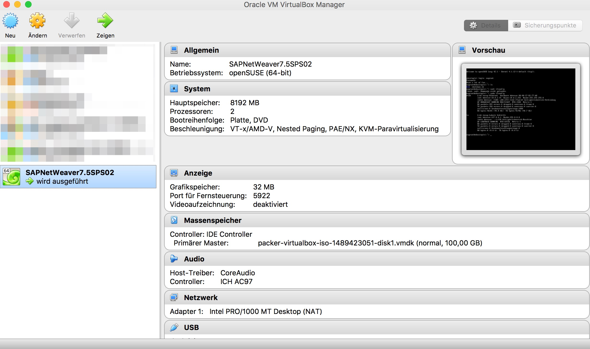

Introduction
============
This repository stores a [Packer](https://www.packer.io) definitions of openSUSE Leap 42.1 for running [Vagrant](https://www.vagrantup.com).
 
The openSUSE Leap 42.1 box can be used to create a VirtualBox instance with Vagrant to install [SAP NW AS ABAP 750 SP02 Developer Edition](https://blogs.sap.com/2016/11/03/sap-nw-as-abap-750-sp02-developer-edition-to-download/?preview_id=391853) .
 
 ## Please also take a look at my second project SAPNW751SPS02
 [wechris/SAPNW751SPS02](https://github.com/wechris/SAPNW751SPS02)
 
 All recommended system preparations will be done by packer and vagrant, as described at [Installing ABAP AS on Oracle VirtualBox](https://blogs.sap.com/2016/11/03/linux-for-newbies-installing-opensuse-on-oracle-virtualbox/?preview_id=391946) without the proxy part (step 11.).

 The steps 20. and 21. **sudo -i*** and ***FINALLY, we run the installation, by entering the command ./install.sh*** must be done manually!
 
Prerequisites
=============
 
On OS X Packer, VirtualBox and Vagrant is available via [Homebrew](http://brew.sh/) on Windows via [Chocolatey](https://chocolatey.org).

OS X: 
```
$ brew install packer
$ brew install virtualbox
$ brew install vagrant
```
optional:
```
$ brew install vagrant-manager
```
 
Usage
=====
Download and extract the [sap_netweaver_as_abap_750_sp02_ase_dev_edition.partX.rar](https://tools.hana.ondemand.com/#abap) files to the folder: *./sapinst*

```
./sapinst/sap_netweaver_as_abap_750_sp02_ase_dev_edition
```

**Packer** 
```
cd packer
cd openSUSE-42.1
$ packer build -only=virtualbox-iso template.json
```
 
**Vagrant**

Only VirtualBox:

If the german keyboard is not desired, comment the following line in the vagrant file
````
# config.vm.provision "shell", path: "install/changetogerman.sh"
````
If the gnome desktop is not desired, comment the following line in the vagrant file
````
# config.vm.provision "shell", path: "install/gnome.sh"
````

```
cd ../../
vagrant up --provision
```

Wait until the vagrant command is finished. Then restart the instance with:
```
vagrant reload
```


**Login**

Login: vagrant/vagrant.

**Install SAP NW AS ABAP 750 SP02 Developer Edition**

The files and folder, on the same level as the vagrant file, will be available under /vagrant
````
sudo -i
<enter pwd>
cd /vagrant
./install.sh
````
Read and accept the license agreement.
When prompted for the OS users password enter your master password of the virtual Linux OS instance.

Start the SAP system:
- Switch to user npladm in the console : **su npladm**
- Start the SAP system : **startsap ALL**

**Post and optional installation steps**

Additional informations, License key and first steps follow [SAP NW AS ABAP 7.50 SP2 – Developer Edition to Download: Concise Installation Guide](https://blogs.sap.com/2016/11/03/sap-nw-as-abap-7.50-sp2-developer-edition-to-download-consise-installation-guide/)

Start/Stop the VBox with:
````
vagrant up
vagrant halt
````
or with the virtualbox UI.

